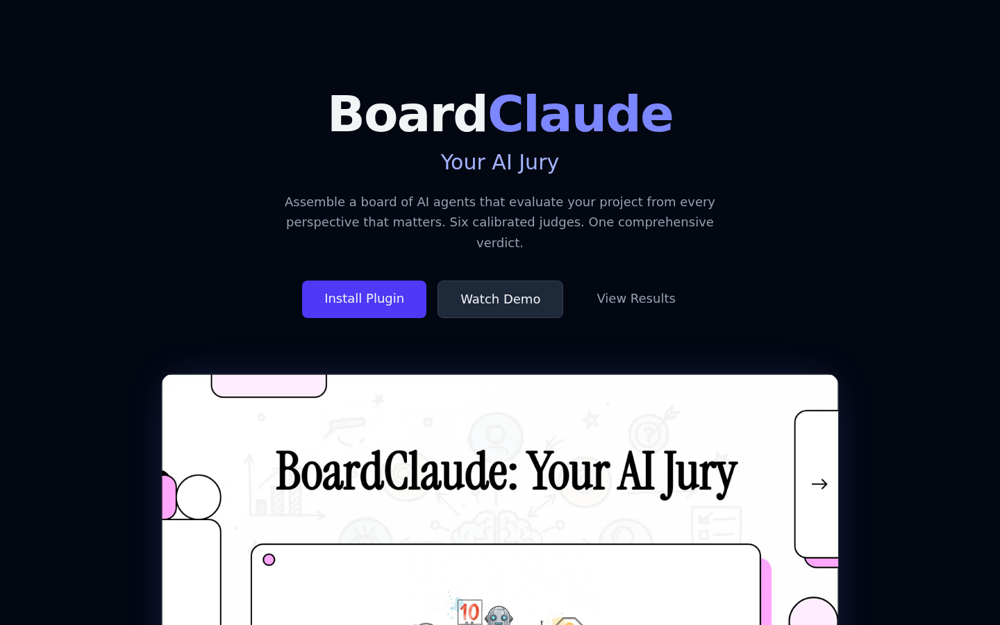
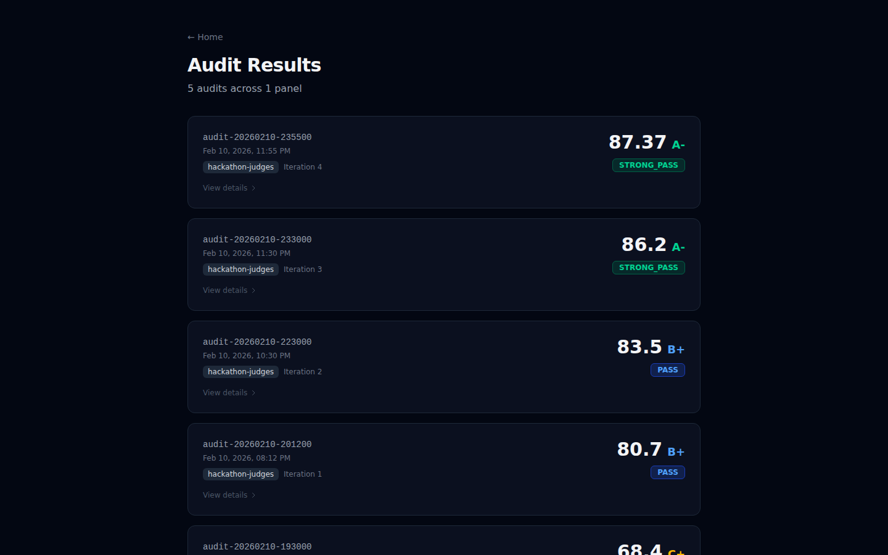
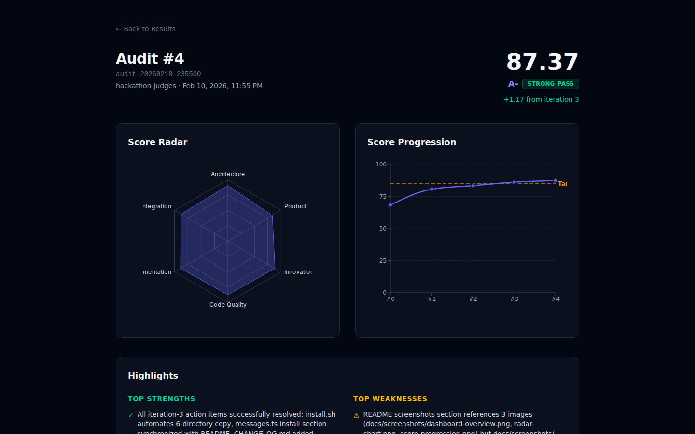

# BoardClaude

**Assemble a board of AI agents that evaluate your project from multiple expert perspectives.**

BoardClaude is a [Claude Code](https://docs.anthropic.com/en/docs/claude-code) plugin that creates configurable panels of AI evaluator agents. Each agent brings a distinct perspective -- architecture, product, innovation, code quality, documentation, community impact -- and scores your project against weighted criteria. Then it fixes the issues it finds, validates the fixes, and re-audits to prove improvement.

## Features

- **Multi-Agent Evaluation** -- 6 specialized agents score your project in parallel using Agent Teams
- **Closed-Loop Improvement** -- Audit, fix, validate, re-audit. Track score progression across iterations
- **Configurable Panels** -- YAML-defined agent panels. Use built-in templates or create your own
- **Real Validation** -- Agents cite real `tsc`, `jest`, `eslint`, `prettier` output, not opinions
- **Visual Dashboard** -- Web UI with radar charts, agent cards, score progression, timeline visualization
- **Panel Templates** -- YAML-defined agent panels with 4 built-in templates, or create your own

## Prerequisites

- [Claude Code](https://docs.anthropic.com/en/docs/claude-code) CLI installed and authenticated
- Node.js 20+ (for the web dashboard)
- Git

## Quick Start

<p align="center">
  
</p>

### Install

```bash
# Option 1: One-command install
git clone https://github.com/ojallington/boardclaude.git
./boardclaude/install.sh your-project/

# Option 2: Manual copy
git clone https://github.com/ojallington/boardclaude.git
cp -r boardclaude/.claude-plugin boardclaude/agents boardclaude/commands \
      boardclaude/skills boardclaude/panels boardclaude/hooks \
      your-project/

# Option 3: Plugin registry (when available)
claude plugin add boardclaude
```

### Run Your First Audit

```bash
# In any project with the plugin installed
/bc:init           # Setup wizard - choose a panel template
/bc:audit          # Run full panel audit (6 agents + synthesis)
/bc:fix            # Implement top action items from audit
/bc:audit          # Re-audit to measure improvement
```

Expected output after a successful audit:

```
Audit complete: audit-20260210-193000
  Composite: 68.4 / 100 (C+, MARGINAL)
  Agents: boris=69.0, cat=71.2, thariq=71.0, lydia=68.1, ado=64.2, jason=62.4
  Action items: 10 (5 low, 3 medium, 2 high)
  Saved to: .boardclaude/audits/audit-20260210-193000.json
```

### Available Commands

| Command | Description |
|---------|-------------|
| `/bc:audit [target]` | Run full panel audit with all agents |
| `/bc:init` | Setup wizard, choose template or create custom panel |
| `/bc:fix [--max N]` | Implement top-N audit action items, validate, re-audit |
| `/bc:review [agent] [target]` | Quick single-agent review |
| `/bc:fork [name]` | Create strategy branch via git worktree |
| `/bc:compare [a] [b]` | Side-by-side branch or audit comparison |
| `/bc:merge [branch]` | Integrate winning branch, archive losers |

### Web Dashboard

```bash
cd dashboard
npm install
npm run dev
# Open http://localhost:3000
```

## Screenshots

| Landing Page | Audit Results | Audit Detail |
|:---:|:---:|:---:|
|  |  |  |

> Live dashboard: [boardclaude.com](https://boardclaude.com)

## Example Output

BoardClaude's first self-audit scored **68.4 / 100 (C+, MARGINAL)** with 6 agents finding real issues:

- **Boris** (Architecture): "Strong architecture with real feedback loops, but zero tests and 20% format compliance"
- **Cat** (Product): "Genuinely novel feedback loop, but adoption path is too steep"
- **Thariq** (AI Innovation): "Smart multi-agent architecture, but emergent behavior is still theoretical"
- **Lydia** (Code Quality): "Clean TypeScript interfaces, but zero test coverage and missing performance optimizations"
- **Ado** (Docs/A11y): "Outstanding README, but not community-ready -- no CONTRIBUTING.md"
- **Jason** (Community): "Strong narrative, but hardcoded English strings limit global reach"

See the full audit JSON: [`examples/audit-example.json`](examples/audit-example.json)

## Examples

The [`examples/`](examples/) directory contains starter files and guides:

| File | Description |
|------|-------------|
| [`quickstart.md`](examples/quickstart.md) | Copy-pasteable install and first-audit walkthrough |
| [`minimal-panel.yaml`](examples/minimal-panel.yaml) | Annotated minimal panel with 2 agents |
| [`custom-agent.md`](examples/custom-agent.md) | Step-by-step guide to creating a custom agent |
| [`audit-example.json`](examples/audit-example.json) | Full audit output from a real self-evaluation |

## Architecture

```
boardclaude/
├── .claude-plugin/plugin.json    # Plugin manifest
├── agents/                       # 7 agent persona files
├── commands/                     # 7 slash command definitions
├── skills/                       # 6 skill implementations
├── panels/                       # Panel YAML configurations
│   ├── hackathon-judges.yaml     # Default: 6-agent evaluation panel
│   └── templates/                # Additional panel templates
├── dashboard/                    # Next.js 15 web app
│   ├── src/app/                  # App Router pages
│   ├── src/components/           # React components
│   └── src/lib/types.ts          # Canonical TypeScript interfaces
└── .boardclaude/                 # Audit state (tracked in git)
    ├── state.json                # Project state
    ├── timeline.json             # Event timeline
    ├── action-items.json         # Action item ledger
    └── audits/                   # Audit result files
```

## Panel Agents

The default `hackathon-judges` panel includes 6 specialized agents:

| Agent | Role | Weight | Model |
|-------|------|--------|-------|
| **Boris** | Architecture & Verification | 20% | Opus |
| **Cat** | Product & User Impact | 18% | Opus |
| **Thariq** | AI Innovation & Intelligence | 18% | Opus |
| **Lydia** | Frontend/DX & Code Quality | 18% | Opus |
| **Ado** | DevRel/Docs & Accessibility | 13% | Sonnet |
| **Jason** | Community Impact & Integration | 13% | Sonnet |

## How It Works

1. **Audit** -- Each agent independently evaluates the codebase against their weighted criteria
2. **Synthesize** -- A synthesis agent merges findings, identifies divergent opinions, prioritizes actions
3. **Fix** -- The fix command implements top-priority action items with validation gates
4. **Re-audit** -- A follow-up audit measures improvement and tracks score delta
5. **Iterate** -- Repeat until target score is reached or improvements plateau

## Custom Panels

Create your own evaluation panel with a YAML config:

```yaml
name: my-review-panel
type: professional
version: "1.0.0"
description: "Custom code review panel"

agents:
  - name: security-expert
    role: "Security & Vulnerability Analysis"
    weight: 0.40
    model: opus
    prompt_file: "agents/security.md"
    criteria:
      - name: vulnerability_scan
        weight: 0.50
      - name: auth_review
        weight: 0.50

  - name: perf-analyst
    role: "Performance & Optimization"
    weight: 0.60
    model: sonnet
    prompt_file: "agents/performance.md"
    criteria:
      - name: response_times
        weight: 0.50
      - name: resource_usage
        weight: 0.50

scoring:
  scale: 100
  passing_threshold: 70
  iteration_target: 85
```

## Tech Stack

- **Plugin**: Claude Code Agent Teams, subagent orchestration
- **Dashboard**: Next.js 15, React 19, TypeScript, Tailwind CSS v4
- **Visualization**: Recharts, Framer Motion
- **Deployment**: Vercel

## License

MIT
